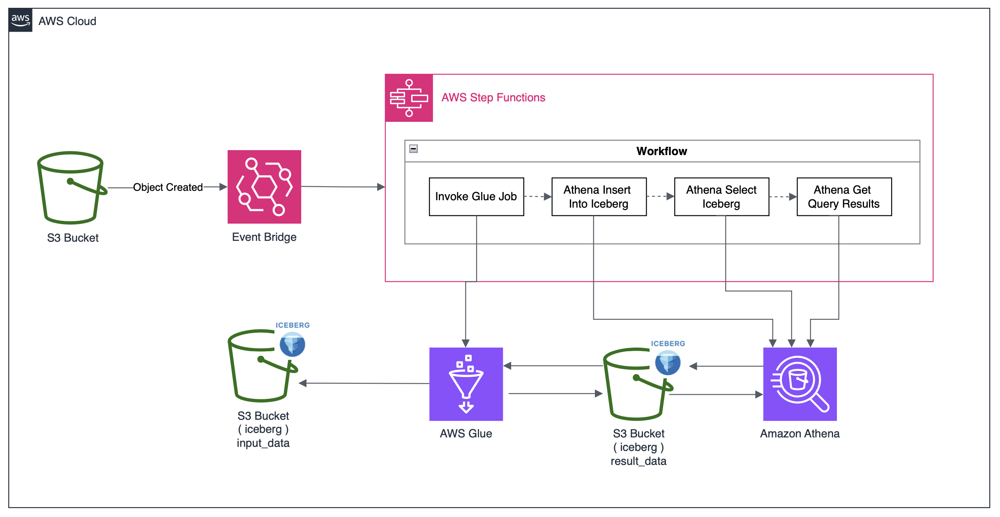

# CDKによるStep Functionを活用したETL開発

## 概要図


## 処理概要
1. 対象のS3バケットにinput_dataを格納するとStep functionsが実行される。
2. Workflowの最初のジョブである「Invoke Glue Job」が起動し、  
  Glueにてinput_dataの5桁に満たないデータをゼロ埋めする。
3.   Workflowの2番目のジョブである「Athena Insert Into Iceberg」が起動し、テーブルにレコードをInsertする。
4.   Workflowの3番目のジョブである「Athena select Iceberg」が起動し、SELECT文を実行する。
5.   Workflowの4番目のジョブである「Athena GetQueryResults」が起動し、SELECT文の結果を返す。

## 目的
本プロジェクトでは、CDK によるインフラ構築、AWS Glueを用いたデータ変換処理およびApache Icebergを活用したデータ管理を学習・実践することを目的としている。

具体的には以下のポイントを重視

- CDKを活用したIaCによりAWS Step Functionsワークフローのデプロイと資産管理
- AWS Glueを利用したETL処理の実装
- Apache Icebergを活用したAthenaのデータ管理の最適化
- EventBridgeを利用したイベント駆動型のETL処理の構築
- 運用を想定した環境ごとの実装(dev, prodの環境構築)に対応

## 使用技術
### nodeバージョン
- node v22.14.0
- npm v10.9.2

### 開発言語
- TypeScript
### IaC
- CDK
### AWS サービス
- Amazon S3
- AWS Glue
- AWS Step Functions
- Amazon Athena
- Amazon EventBridge
- AWS IAM
### その他
- Apache Iceberg

## デプロイ手順
```
cdk deploy DevStack
```

## 参考資料

- [AWS CDK API Reference](https://docs.aws.amazon.com/cdk/api/v2/docs/aws-construct-library.html)
- [TypeScript の基礎から始める AWS CDK 開発入門](https://catalog.workshops.aws/typescript-and-cdk-for-beginner/ja-JP)
- [使い慣れたプログラミング言語でクラウド環境を構築 ! AWS CDK をグラレコで解説](https://aws.amazon.com/jp/builders-flash/202309/awsgeek-aws-cdk/)
- [【CDK】Step FuctionsでGlue Python Shellを実行](https://dev.classmethod.jp/articles/step-functions-glue-python-shell-with-cdk/)
- [Lambda+Glue+Step Functionsの構成をAWS CDKでデプロイしてみた](https://dev.classmethod.jp/articles/lambda-glue-etl-deploy-aws-cdk/#toc-3)
