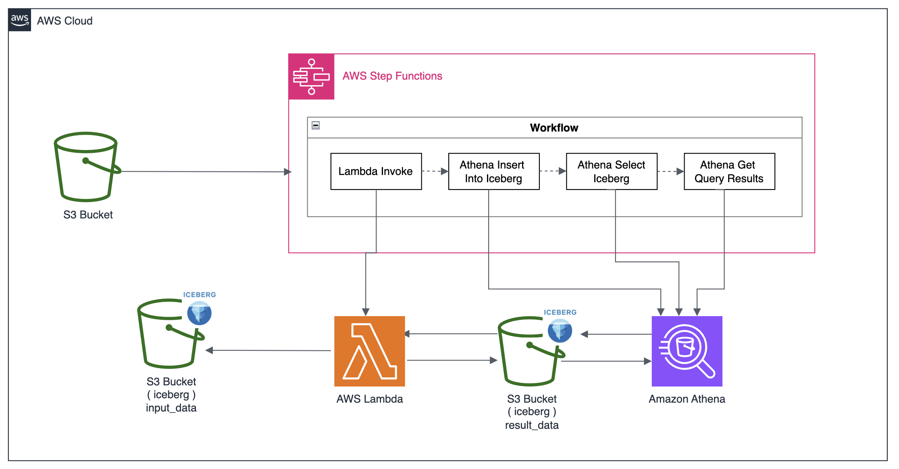

# SAMによるStep Functionを活用したETL開発

## 概要図


## 処理概要
1. 対象のS3バケットにinput_dataを格納し、Step functionsを手動実行する。
2. Workflowの最初のジョブである「Lambda Invoke」が起動し、  
  Lambdaにてinput_dataの5桁に満たないデータをゼロ埋めする。
3.   Workflowの2番目のジョブである「Athena Insert Into Iceberg」が起動し、テーブルにレコードをInsertする。
4.   Workflowの3番目のジョブである「Athena select Iceberg」が起動し、SELECT文を実行する。
5.   Workflowの4番目のジョブである「Athena GetQueryResults」が起動し、SELECT文の結果を返す。

## 目的
本プロジェクトでは、CDK によるインフラ構築、AWS Glueを用いたデータ変換処理およびApache Icebergを活用したデータ管理を学習・実践することを目的としている。

具体的には以下のポイントを重視

- AWS Step Functionsワークフローでのジョブ作成
- AWS Lambdaを利用したETL処理の実装
- Apache Icebergを活用したAthenaのデータ管理の最適化

## 使用技術

### 開発言語
- Python
### IaC
- AWS Serverless Application Model （AWS SAM）
### AWS サービス
- Amazon S3
- AWS Lambda
- AWS Step Functions
- Amazon Athena
- AWS IAM
### その他
- Apache Iceberg

## デプロイ手順
```
sam deploy 
```

## 参考資料

- [AWS Step Functions をゼロからざっくり理解する](https://dev.classmethod.jp/articles/aws-step-functions-for-beginner/)
- [Step Functions でステートマシンの実行を開始する
](https://docs.aws.amazon.com/ja_jp/step-functions/latest/dg/statemachine-starting.html)
- [AWS Serverless Application Model （AWS SAM) とは](https://docs.aws.amazon.com/ja_jp/serverless-application-model/latest/developerguide/what-is-sam.html)
